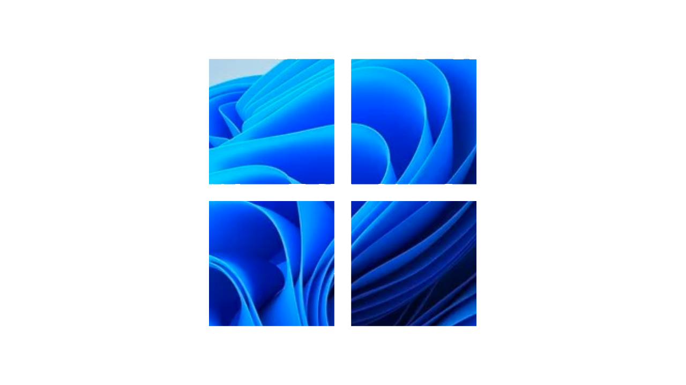

<h1 align="center">Windows 11 Theme </h1>
- logo by unofficialdxnny
## Wallpapers

## 1) Download Windows 11 Wallpapers
Just download the below image :)

  Well, after downloading the Windows 11 wallpapers, you need to right-click on it and select the ‘Set as background’ option. This will set the wallpaper on your Windows 10 pc.
  

## 2) Apply Windows 11 Themes/Skins & Icons on Windows 10:

  Once done with the wallpaper, you need to install the Windows 11 skin pack. However, before installing a skin pack, creating a system restore point is recommended because installing skin requires registry modification.
  

  
  
  -  First of all, head to this link and download the latest SecureUxTheme on your PC.

  
  
 - Next, download the <a href="https://www.deviantart.com/niivu/art/Windows-11-for-Windows-10-882819383">Windows 11 for Windows 10 theme</a> on your PC. You might be asked to create a DeviantArt account to download the theme.
  
 

  
  
  
- Next, download the <a href="https://www.deviantart.com/niivu/art/Windows-11-Icon-Theme-874289797">Windows 11 Icon Theme</a> from the same developer.

  

- Now, place both theme and icon pack in the same folder and extract the files.

- Next, right-click on the SecureUXTheme installer file and select the Run as administrator option. Complete the installation and then restart your PC.  

  

- Now, open the folder where you have stored the Theme and Icon pack. Inside the theme folder, locate Windows 10 themes sub-folder. Inside that, you will find two more sub-folders for taskbar sizes. Copy the size that you prefer.

  
    

- 7. Paste the folder to the C:\Windows\Resources\Themes

  

- 8. Now, re-run the SecureUXTheme file, and you will notice a new theme. Select the new theme and click on the ‘Patch and Apply’ button.

  
 

 
 
 
 To apply the Windows 11 icon pack, you need to download the <a href="https://www.deviantart.com/devillnside/art/7TSP-GUI-2019-Edition-804769422">7TSP GUI from DeviantArt</a>. It’s a tool that lets you apply custom icon packs on Windows 10.

That’s it! You are done. This is how you can use SecureUXtheme to change Windows 10’s look into Windows 11.
